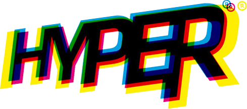

  
  <h1 align="center">About Me 💫</h2>
  
  

    Hi there! 👋 I'm Nicolescu Robert, also known as Tipy, a passionate developer always seeking new challenges and opportunities for growth. With a strong background in frontend development, I thrive in collaborative environments where innovation and teamwork are valued.
  

  
  

    Continuous learning is my mantra, and I love pushing myself to explore new technologies and expand my skill set. 💡 You'll often find me participating in hackathons, working on awesome projects, and collaborating with talented individuals to deliver outstanding results.
  

  

  <h1 align="center">My Development Philosophy</h2>

  

    🤝 I believe in open and honest communication, respecting deadlines, and fostering a positive and inclusive work environment. As a team player and a natural leader, I am always ready to take on new challenges and guide the team towards success.
  

  

    ⏰ I understand the importance of prioritizing tasks and making informed decisions. If I encounter any difficulties that might affect project delivery, I proactively communicate and seek solutions to ensure transparency and accountability.
  

<h1 align="center">Frontend Journey 📈</h2>

<table border="0">
  <tr align="center">
    <td width=600>
      
    <td width=600>
      
    </td>
  </tr>
  
  <tr align="center">
    <td>
      <strong>MWS (My 1st Site)</strong>
    </td>
    <td>
      <strong>Hyper</strong>  
    </td>
  </tr>
  
  <tr align="center">
    <td>
      Reflecting on my journey, <a href="https://github.com/TIPYexe/mws.github.io">MWS</a> was one of my earliest projects where I honed my skills as a frontend developer. Despite its humble beginnings, this project truly sparked my interest in this field.
    </td>
    <td>
      <a href="https://github.com/Bb4k/hyper-frontend">Hyper</a> represents my best work thus far, showcasing my expertise in frontend development and project leadership. Inspired by the gym culture, this social media platform is a testament to my ability to create innovative solutions that resonate with users.
    </td>
  </tr>
</table>

  
  <h1 align="center">What I'm working on ⌛</h2>
  
  

    Currently, I am delving into backend development to broaden my expertise and embrace new horizons. I enjoy exploring different fields as it keeps me motivated and enables me to tackle complex problems with a fresh perspective.
  

  

  <h2>Thank You! 🙏</h2>

  

    Thank you for visiting my GitHub profile. I look forward to sharing more exciting projects and collaborations with you. Let's make the world of development a better place, one line of code at a time!
  

## 🌐 Let's connect:
 

# 💻 Tech Stack:
                                   
